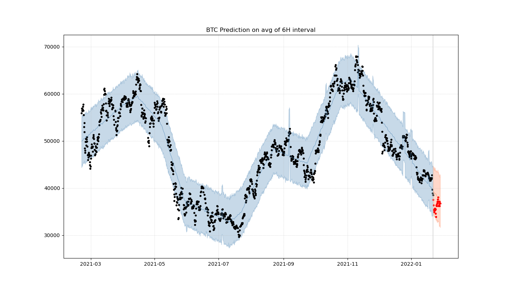

# CoinPy
CoinPy is an open-source project for cryptocurrency data acquisition and modelling.

## Installation
```bash
git clone https://github.com/Demirrr/coin-py
conda env create -f environment.yml
pip install -e .
```

## Train & Predict
See [Plots](Plots) for other crypto cryptocurrency analysis


# Services

- [ ] Trade Assistants
  -  Given a portfolio (total asset and its allocation), how would have a trade assistant suggest in the last X hours

### In Progress
- [ ] Customizable Notifier
  - How much did prices and volumes of coins change in the last X hours ?
  - What to do in next few hours ?

### Done ✓

- [x] Create fetching coins from Coinbase.
- [x] Provide information about coins.
- [x] Automatizing Data Acquisition
- [x] Automatizing Forecasting 
  - With [Prophet](https://facebook.github.io/prophet/)
  
# Help and Support
For any further questions or suggestions, please contact: caglardemir8@gmail.com