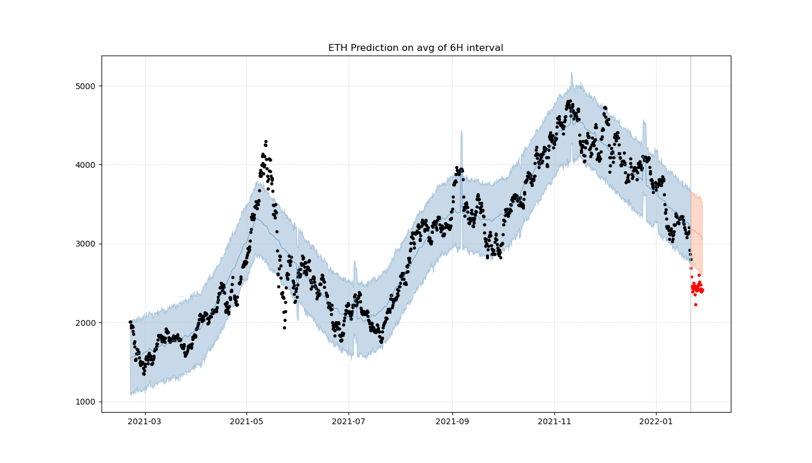

# CoinPy
CoinPy is an open-source project for cryptocurrency data acquisition and modelling.

## Installation
```bash
git clone https://github.com/Demirrr/coin-py
conda env create -f environment.yml
pip install -e .
```

### Analysis on BTC, ETH, and MATIC on every 5 minutes of 2021
#### Bitcoin USD

#### Ethereum USD

#### Polygon USD


# Services

- [ ] Customizable Notifier
  - How much did prices and volumes of coins change in the last X hours ?
- [ ] Trade Assistants
  -  Given a portfolio (total asset and its allocation), how would have a trade assistant suggest in the last X hours

### In Progress

- [ ] Data Acquisition
- [ ] Forecasing 
  - With [Prophet](https://facebook.github.io/prophet/) 
  - DQL agent

### Done ✓

- [x] Create fetching coins from Coinbase.
- [x] Provide information about coins.

# Help and Support
For any further questions or suggestions, please contact: caglardemir8@gmail.com